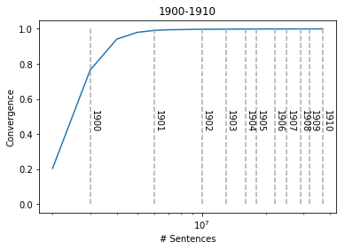

# Word2Vec convergence
This repository contains Python implementation of the data-driven method for determining the level of convergence of a semantic model, described here <**LINK TO PAPER HERE**>. This method enables us to train semantic models with enough data for the model to capture the semantic structure of language and stop the training when the model does not benefit significantly from the additional data.

These scripts can also be used to generate time-shifting models produced which can used by [ShiCo](https://github.com/NLeSC/ShiCo) ([find more details here](https://dspace.library.uu.nl/handle/1874/346303)).

**IF DATA PUBLICATION IS READY**
Time-shifting models generated using this method (based on Times newspaper (link?)) can be found here (link to data publication).

## Running these scripts
The requirements.txt file provided here can be used to install Python requirements:

```
pip install -r requirements.txt
```

These scripts were designed to read data from the Times newspaper. However, they can be easily adjusted to work with your own data. For this, you need to modify the following functions in `helpers.py`:

```python
def getYears():
  # <add your own implementation>
  pass

def getSentencesForYear(year):
  # <add your own implementation>
  pass
```

The `customhelpers.py` file provides an example implementation of these functions.

If required, you may also need to implement your own `settings.py` (if required). This is used by `helpers.py` to determine location of data and cache directories. If you modify `getSentencesForYear` in such a way that caching is not required, then you don't need `settings.py`.

Once you have your own implementations, you should be ready to process your own data.

## Measure convergence for a range
The first step is to determine the convergence of word2vec models generated from a given period of time within the corpus. The `runConvergenceRange.py` script can be used for this purpose. For example:

```
./runConvergenceRange.py --y0=1900 --nYears=10 --outDir=outDir/
```

This would determine the convergence for word2vec models generated from data starting in 1900, spanning 10 years (until 1909). Results from this script are saved on the given directory (`outDir/`) on the example above.

It may be a good idea to run for more than one time period (e.g. 1900-1910, 1910-1920, etc.).

## Visualize Measured convergence
Once you have generated convergence ranges, you can use the `VisualizeConvergence.ipynb` Jupyter notebook provided hereto visualize your results.

You need to set the `outDir` variable in one of the notebook cells to the output directory used to save results from the previous step (e.g. `outDir` on our previous example). The notebook can then be run to produce convergence graphs like the following:



The blue line on this graph shows the level of convergence between consecutive generated models. The horizontal axis indicates the number of sentences which have been used to produce the model (in logarithmic scale). Vertical grey lines indicate when the data from a given year has been exhausted.

In this case, our word2vec model started by adding data from 1900. Once the data from 1901 has been added, the convergence measure is already close to 1, indicating that the model has converged and the addition of new data does not represent a significant change to the model.

## Generate time shifting models
Based on the graph above, we could take the decision to generate a set of time-shifting models where every model incorporates 2 years of data. The `runGenerateModels.py` script can be used to generate such a set of models.

Example:
```
./runGenerateModels.py --y0=1900 --yN=1910 --nYears=2 --outDir=outDir/ --step=1
```

This will generate a set of word2vec models, starting from 1900 and until 1910, where every model contains 2 years worth of data. This will produce the following models:

Models        |
--------------|
1900_1902.w2v |
1901_1903.w2v |
1902_1904.w2v |
1903_1905.w2v |
1904_1906.w2v |
1905_1907.w2v |
1906_1908.w2v |
1907_1909.w2v |
1908_1910.w2v |
1909_1911.w2v |

# Licensing
Source code in this repository is licensed under the [Apache License](LICENSE).
